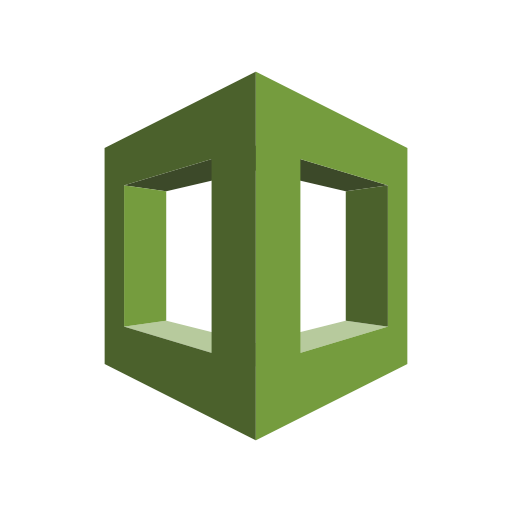
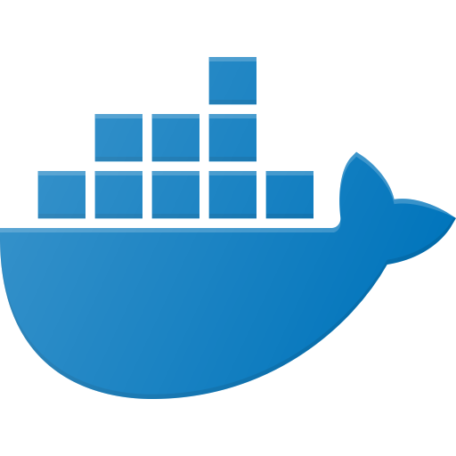

# Cloudformation-IPSec-VPN

## Table of contents

1. [Project Outline](#Outline)
    - [Key Technologies](#Technologies)
    - [A Note About Open Resolvers](#Resolver)
2. [Installation](#Installation)
    - [Before You Begin](#Begin)
    - [Running the Template](#Run)
    - [Client Configuration](#Client)
3. [Template Details](#Details)
    - [Workflow](#Workflow)
    - [Parameters](#Parameters)
8. [Reference](#Reference)
---

## Project Outline

This project is for a CloudFormation template that automates the creation of a DNS server. It uses docker to deploy an IPSec VPN Server in a docker container on EC2 with both IPsec/L2tP and Cisco IPSec behind WatchTower. Can be used for securing your cloud infrastructure, privacy, geolocation overrides, etc. Not designed for organizations but works with multiple VPN user accounts for home use.

Based on the DevOps theory of infrastructure as code, this AWS CloudFormation template is an automated and portable process that anybody can run. The stack is fully automated and persistent which means that everything is created at run time and all configurations are saved so it can be reused for redeployment.

#### Key Technologies

This project is a CloudFormation template coded in YAML. I’m leveraging the following AWS services:

 
 
 

  
Docker containers are used for ease of management. This modular environment allows for complex systems to be rapidly deployed in a consistent manner.
  

---

## Installation

This section describes how to deploy the stack. Resource creation, key creation, and system configuration is automated to minimize preparation.

#### Before You Begin

Using this template requires the following:
- An AWS account.
- A Key Pair to associate with the EC2 instance for ssh connections.
- A domain registered on Route 53.

#### Running the Template

There are two methods for running the template. The quick-create link automatically loads the template and puts all of the deployment options on one page. The second method provides additional configuration options for management and troubleshooting.

- Quickstart URL:

1. Click on the quick-create link [here](https://console.aws.amazon.com/cloudformation/home?region=us-east-1#/stacks/quickcreate?templateUrl=https%3A%2F%2Fursyscloudformationtemplates.s3.amazonaws.com%2FIPSec%2520Vpn%2FIPSecVPN.yml&stackName=IPSecVPNServer&param_AmiId=%2Faws%2Fservice%2Fami-amazon-linux-latest%2Famzn2-ami-hvm-x86_64-gp2&param_ClientIPCIDR=0.0.0.0%2F0&param_CreateDefaultSSHSecurityGroup=false&param_DNSServ01=1.1.1.1&param_DNSServ02=1.0.0.1&param_DomainName=&param_EC2InstanceType=t3.nano&param_Route53zoneId=&param_SSHKeyName=&param_SubnetAZ=&param_VPNAdditionalPasswords=&param_VPNAdditionalUserNames=&param_VPNIPSecPSK=&param_VPNPassword=&param_VPNUser=)
  2. Enter the desired parameters (See the [Parameters](#Parameters) section below)
      -  At minimum, you will need to specify the following:
 	      - KeyPair
 	      - Availability Zone
        - VPN PreShared Key
        - VPN Username
        - VPN Password
  3. Click "*Create*".

- Deployment through the [CloudFormation site](https://console.aws.amazon.com/cloudformation/):

 1. *Select Template*
     - Choose "Upload the template to Amazon S3" and then specify the file location.
 2. *Enter the desired parameters (See the [Parameters](#Parameters) section below)*
     -  At minimum, you will need to specify the following:
	      - Stack name
        - KeyPair
        - VPN PreShared Key
 	      - Availability Zone
        - VPN Username
        - VPN Password
 3. *Select Options*
     - You can leave the defaults but for troubleshooting issues go to advanced and disable "Rollback on failure".
 4. *Create*
     - Click "Create" and wait for the stack to build. It will take 3-5 minutes to complete. When it's finished, the status will say "CREATE_COMPLETE".

#### Client Configuration

Get your computer or device to use the VPN. Please refer to:

**[Configure IPsec/L2TP VPN Clients](https://github.com/hwdsl2/setup-ipsec-vpn/blob/master/docs/clients.md)**

**[Configure IPsec/XAuth ("Cisco IPsec") VPN Clients](https://github.com/hwdsl2/setup-ipsec-vpn/blob/master/docs/clients-xauth.md)**

If you get an error when trying to connect, see [Troubleshooting](https://github.com/hwdsl2/setup-ipsec-vpn/blob/master/docs/clients.md#troubleshooting).

---

## Template Details

This section describes the behavior of the Cloudformation template as well as the available parameters that you can specify at launch.

#### Workflow

1. The template creates a VPC with a subnet, an Internet Gateway, route table, and a route are attached to give the network a static route to the internet.
2. A security group is created with ACLs for the appropriate ports.
3. A Network Interface is connected with source/Destination checking disabled and associated with the security group.
4. An ElasticIp is assigned to our Network interface  
5. Route53 is configured to provide an A record to the Elastic IP.
6. An EBS volume is created and, optionally, a default SSH group for using your IPSec server as a gateway into your AWS environment
7. Creates the IPSec Server Instance on EC2, which runs UserData to install docker, invoke cfn-init and signal cfn-signal
8. Within cfn-init, we setup the working environment for docker, pipe in our parameters to our .env file for the IPSec container with echo and sed
9. We create a docker bridge network for IPSec and WatchTower
10. We create our docker containers, IPSec-VPN-Server and WatchTower

#### Parameters

These are the parameters used by the stack. Some are optional depending on your configuration. After you load the template into CloudFormation, you will be presented with a page requesting the following.

##### EC2 Configuration
- *EC2 Instance Type:* (Default: t3.nano) The EC2 instance type that determines the CPU and memory configuration. The default t3.nano is the smallest and cheapest option and is more than capable for this application. If you are still within the first year of your AWS free tier then a t2.micro would be cheaper.
- *AMI Id:* (Default: /aws/service/ami-amazon-linux-latest/amzn2-ami-hvm-x86_64-gp2) This is the Amazon Machine Image, the base operating system and version that will be used to create your EC2 instance.  The default is configured to grab the latest version of Amazon Linux2. You could specify a different AMI but it may require different User Data values depending on the installed software.
- *KeyPair:* (Required) This is your key pair that is used when making an SSH connection to an EC2 instance. You will need to have created this before hand.

##### Network Configuration
- *Route 53 Zone ID:* (Optional) The Route 53 ZoneId for the domain you will associate with the server.
- *Domain Name:* (Optional) The name of A record for you EC2 instance, for example, vpn.example.com
- *Client CIDR:* (Default: 0.0.0.0/0) The CIDR IP granted access by the Security Group. You can limit this to a specific IP but most people are behind DHCP. You could also specify a range used by your ISP to limit access. The default accepts all IPs.
- *Availability Zone:* (Required) The availability zone for the subnet where the EC2 instance will be created. It must match the location of your EBS volume.

#### VPN Configuration
- *VPN IPSec PreShared Key:* (Required) The Preshared Key for the VPN Server you will use to authenticate alongside your user credentials
- *VPN Username:* (Required) The username for the primary account on the VPN server. You will use this to authenticate in your VPN Client alongside the PSK.
- *VPN Password:* (Required) The password for the primary account on the VPN server.

#### Advanced Configuration
- *Primary DNS Server Address:* (Optional) (Default: 1.1.1.1) The primary DNS server for your VPN. If left unfilled, will use Cloudflare by default. If left blank, will use Google Public DNS
- *Secondary DNS Server Address:* (Optional) (Default: 1.0.0.1) The secondary DNS server for your VPN. If left unfilled, will use Cloudflare by default. If left blank, will use Google Public DNS
- *Additional VPN Usernames:* (Optional) Add additional usernames for authentication and identity management here. Each username should be separated with a space. This is coordinated with Additional VPN Passwords. Assuming VPN_ADDL_USERS=foo bar and VPN_ADDL_PASSWORDS=bar foo the password for user foo is bar and the password for user bar is foo.
- *Additional VPN Passwords:* (Optional) Add additional passwords for authentication and identity management here. Each password should be separated with a space. This is coordinated with Additional VPN Usernames. Assuming VPN_ADDL_USERS=foo bar and VPN_ADDL_PASSWORDS=bar foo the password for user foo is bar and the password for user bar is foo.

## Reference

I'm using the following docker images in this project:
- [hwdsl2/ipsec-vpn-server](https://github.com/hwdsl2/docker-ipsec-vpn-server)
- [v2tec/watchtower](https://hub.docker.com/r/v2tec/watchtower/)

I found a number of valuable sources when researching this project:
- Much of the readme.md formatting comes from [CloudEric/dnsvpn-cloudformation](https://github.com/CloudEric/dnsvpn-cloudformation), and I first learned CloudFormation syntax from his scripts. It also inspired me to containerize everything.
- The [IPSec Documentation](https://hub.docker.com/r/hwdsl2/ipsec-vpn-server/) has proven to be an extremely valuable resource for information on creating VPN tunnels and troubleshooting tunnel creation.
- [This blog](http://40cloud.com/setting-up-ipsecopenswan-in-amazon-ec2/) describes how to configure EC2 security groups for UDP encapsulation.

## License

Copyright (C) 2019 [Sara Angel Murphy](https://www.linkedin.com/in/saraangelmurphy) 
Based on [the work of Lin Song](https://github.com/hwdsl2/setup-ipsec-vpn) (Copyright 2016-2019)

This work is licensed under the [Creative Commons Attribution-ShareAlike 3.0 Unported License](http://creativecommons.org/licenses/by-sa/3.0/)   
Attribution required: please include my name in any derivative and let me know how you have improved it!
